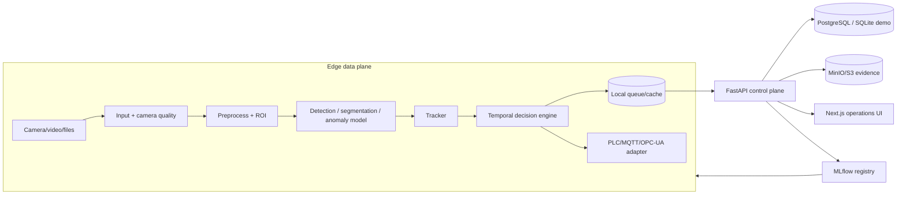
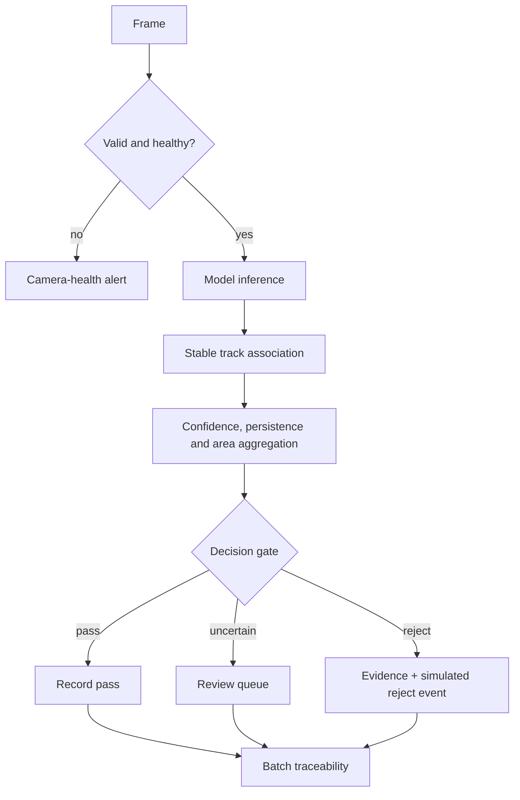
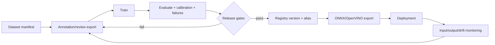
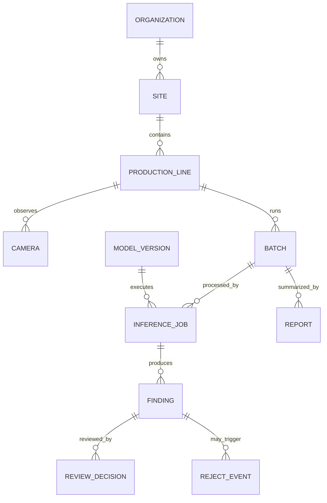
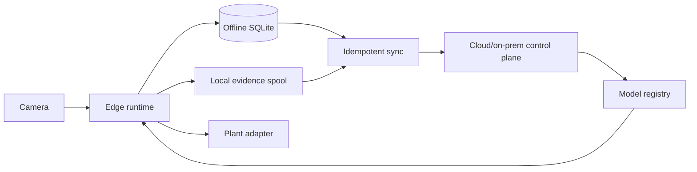
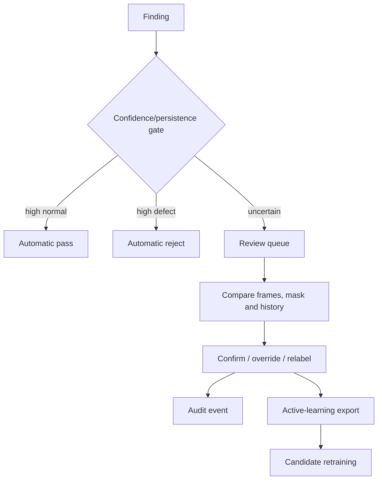

# Architecture

```mermaid
flowchart LR
  subgraph Edge[Edge data plane]
    C[Camera/video/files] --> Q[Input + camera quality]
    Q --> P[Preprocess + ROI]
    P --> M[Detection / segmentation / anomaly model]
    M --> T[Tracker]
    T --> D[Temporal decision engine]
    D --> L[(Local queue/cache)]
    D --> A[PLC/MQTT/OPC-UA adapter]
  end
  L --> API[FastAPI control plane]
  API --> DB[(PostgreSQL / SQLite demo)]
  API --> OBJ[(MinIO/S3 evidence)]
  API --> W[Next.js operations UI]
  API --> ML[MLflow registry]
  ML --> Edge
```

## Real-time inference workflow

```mermaid
flowchart TD
  I[Frame] --> V{Valid and healthy?}
  V -- no --> H[Camera-health alert]
  V -- yes --> X[Model inference]
  X --> K[Stable track association]
  K --> G[Confidence, persistence and area aggregation]
  G --> C{Decision gate}
  C -->|pass| P[Record pass]
  C -->|uncertain| R[Review queue]
  C -->|reject| E[Evidence + simulated reject event]
  P --> B[Batch traceability]
  R --> B
  E --> B
```

## MLOps lifecycle

```mermaid
flowchart LR
  D[Dataset manifest] --> A[Annotation/review export]
  A --> T[Train]
  T --> E[Evaluate + calibration + failures]
  E --> G{Release gates}
  G -- fail --> A
  G -- pass --> R[Registry version + alias]
  R --> X[ONNX/OpenVINO export]
  X --> P[Deployment]
  P --> M[Input/output/drift monitoring]
  M --> A
```

## Domain model

```mermaid
erDiagram
  ORGANIZATION ||--o{ SITE : owns
  SITE ||--o{ PRODUCTION_LINE : contains
  PRODUCTION_LINE ||--o{ CAMERA : observes
  PRODUCTION_LINE ||--o{ BATCH : runs
  BATCH ||--o{ INFERENCE_JOB : processed_by
  INFERENCE_JOB ||--o{ FINDING : produces
  MODEL_VERSION ||--o{ INFERENCE_JOB : executes
  FINDING ||--o{ REVIEW_DECISION : reviewed_by
  FINDING ||--o{ REJECT_EVENT : may_trigger
  BATCH ||--o{ REPORT : summarized_by
```

## Edge/offline deployment

```mermaid
flowchart LR
  CAM[Camera] --> RT[Edge runtime]
  RT --> ODB[(Offline SQLite)]
  RT --> EVID[Local evidence spool]
  RT --> PLC[Plant adapter]
  ODB --> SYNC[Idempotent sync]
  EVID --> SYNC
  SYNC --> CLOUD[Cloud/on-prem control plane]
  CLOUD --> REG[Model registry]
  REG --> RT
```

## Human review

```mermaid
flowchart TD
  F[Finding] --> G{Confidence/persistence gate}
  G -->|high normal| AP[Automatic pass]
  G -->|high defect| AR[Automatic reject]
  G -->|uncertain| Q[Review queue]
  Q --> V[Compare frames, mask and history]
  V --> C[Confirm / override / relabel]
  C --> AUD[Audit event]
  C --> EXP[Active-learning export]
  EXP --> TRAIN[Candidate retraining]
```
